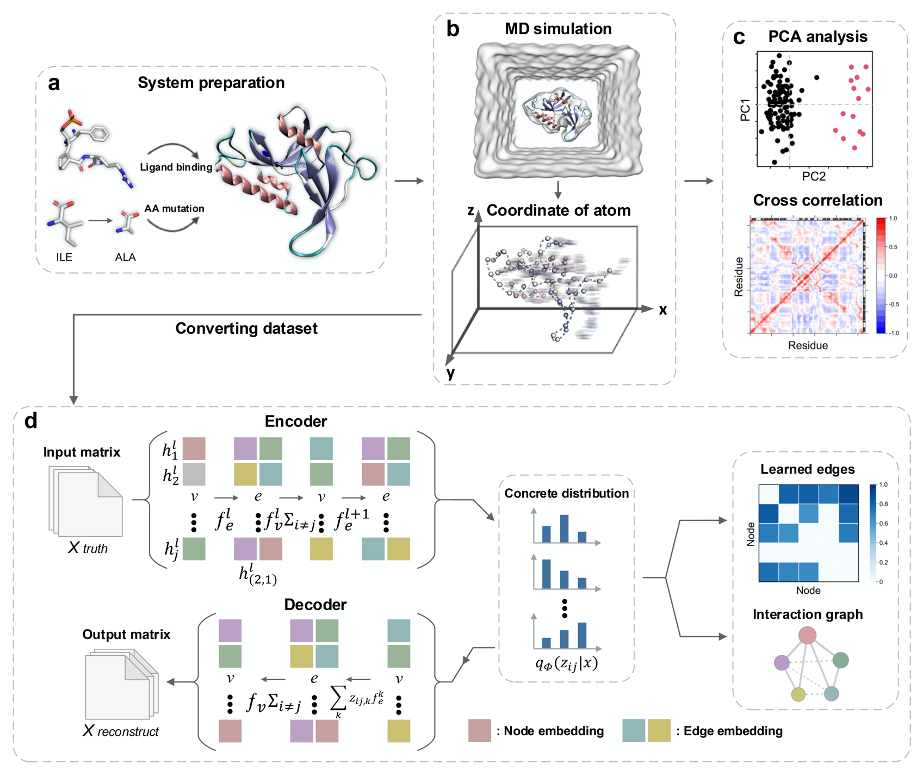

# Neural relational inference to learn allosteric long-range interactions in proteins from molecular dynamics simulations

**Abstract:** Protein allostery is a biological process facilitated by spatially long-range intra-protein communication, whereby ligand binding or amino acid mutation at a distant site affects the active site remotely. Molecular dynamics (MD) simulation provides a powerful computational approach to probe the allostery effect. However, current MD simulations cannot reach the time scales of whole allostery processes. The advent of deep learning made it possible to evaluate both spatially short and long-range communications for understanding allostery. For this purpose, we applied a neural relational inference (NRI) model based on a graph neural network (GNN), which adopts an encoder-decoder architecture to simultaneously infer latent interactions to probe protein allosteric processes as dynamic networks of interacting residues. From the MD trajectories, this model successfully learned the long-range interactions and pathways that can mediate the allosteric communications between the two distant binding sites in the Pin1, SOD1, and MEK1 systems.



### Requirements
* Pytorch 1.2
* Python 3.7
* networkx 2.5 (Optional, only used in post analysis)

### Prepare Molecular Simulation Trajectories

Place your molecular simulation trajectories in data/pdb folder. We have ca_1.pdb for the tutorial usage.

```
python convert_dataset.py
```

This step will seperate train/validation/test dataset, and generate .npy files in data folder.

### Run experiments

From the project's root folder, simply run
```
python main.py
```
### Post Analysis
Visualize the inferred the interaction between residues and domains
```
python postanalysis_visual.py
```

Find the shortest path between residues
```
python postanalysis_path.py
```

### Data availability
All the MD trajectories used in the study can be downloaded from https://doi.org/10.5281/zenodo.5941385

### Cite
If you make use of this code in your own work, please cite our paper:

**Neural relational inference to learn long-range allosteric interactions in proteins from molecular dynamics simulations.**  
Jingxuan Zhu,  Juexin Wang, Weiwei Han,  Dong Xu,
Nature communications 13, no. 1 (2022): 1-16.
https://www.nature.com/articles/s41467-022-29331-3

### Reference
We thank the official implementation of neural relational inference at
https://github.com/ethanfetaya/NRI

